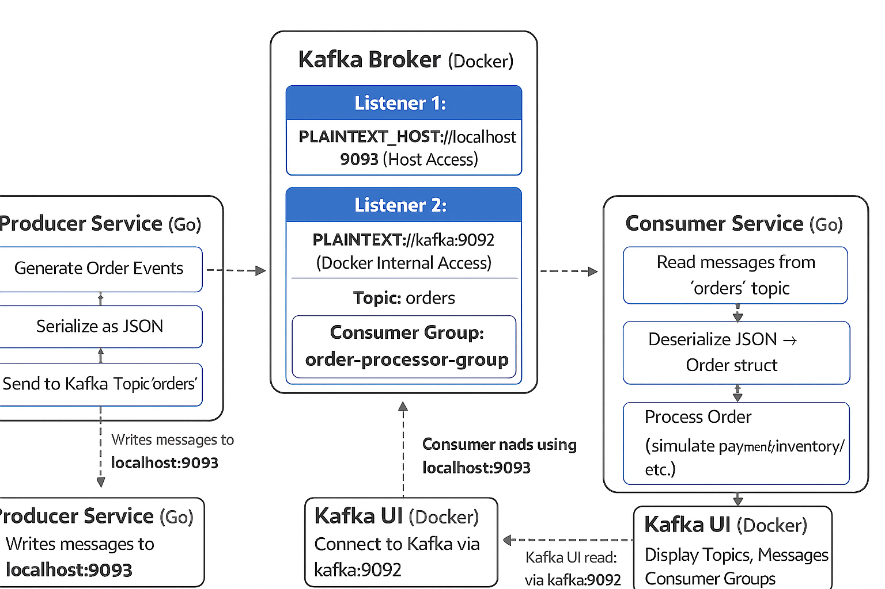

# kafka-playground
Sample project showcasing kafka use-cases

# Architecture Diagram



---

# End to End testing flow

From project root:

## 1. Start Kafka stack
```
docker-compose up -d
```

## 2. Run consumer first (so it’s ready to eat messages):
```
go run ./cmd/consumer
```

## 3. In another terminal, run producer:
```
go run ./cmd/producer
```

You’ll see logs like:
```
Producer:
Produced order: ID=order-123456 User=user-7 Amount=77.32 USD
Consumer:
[PROCESSOR] Received order: ID=order-123456 User=user-7 Amount=77.32 USD Status=CREATED
```

Inspect in Kafka UI
Open `http://localhost:8080`
You should see the orders, topic and messages streaming in.
